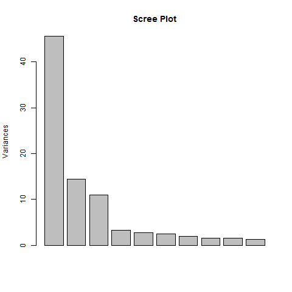
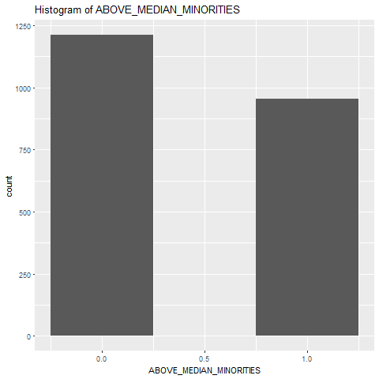
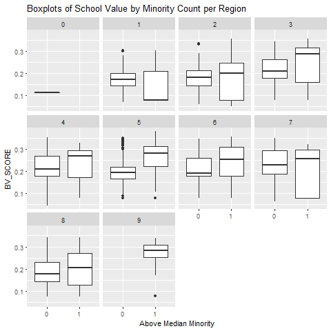
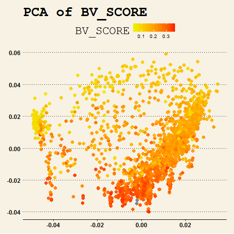
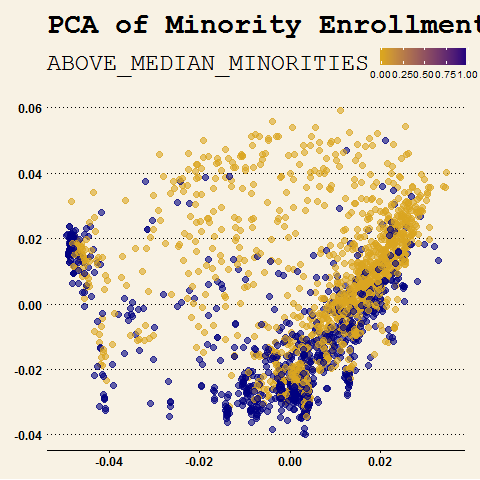

Education Project
========================================================
Shannon Chang - Economics with minor in English  
Jared Wilber - Statistics & Gender and Women Studies   
Nura Kawa - Statistics  
Manuel Horta - Statistics    

December 8, 2016    

Problem Statement
========================================================
Our client is a non-profit NGO with an interest in minority success. Primarily, they'd like to identify schools that underserve minorities so that they can donate money to those schools to create more effective minority-targeting. They don't want their money to go to waste, so they'd like to target the best schools they can. We help in two ways:   

-First, we provide a method for identifying those schools which underserve minorities.   
-Second, we define a data-driven metric value metric that can be used to rank the schools.  

Introduction
========================================================

To help the NGO, we'll need data. We're utilizing data from [college scorecard](https://collegescorecard.ed.gov/data/). This dataset provides federally reported information about universities in the United States of America. We'll utilize this data to help the NGO achieve the following objective: determine whether a given university underserves minorities. By underserves, we mean has less than the US median percentage of minorities enrolled. We also create a data-driven metric that ranks the value of universities. Our analysis culminates in a user-friendly app that the NGO will use to identify whether or not a university serves minorities. The app also lists similar universities ranked in order of the value metric we created.

========================================================
In this manner, the NGO can employ us in the following 2 ways:

- Given multiple minority serving schools, determine which should receive funding.
- Given a school, predict whether or not it will underserve or overserves minorities.

We realize the first goal with our created metric.
We realize the second goal with our classifier, which takes in some features as input and outputs a binary label: whether or not a school underserves or adequately serves minorities.

Data
========================================================
As stated previously, the data is freely available at [college scorecard](https://collegescorecard.ed.gov/data/). The data contains multiple datasets, corresponding to different years.
Because of fluctuations regarding data completion (i.e. some datasets are more sparse than others), we opted to use the most recent dataset, as it was relatively dense. Furthermore, this dataset is more likely to reflect present day trends. 

The dataset lives in very high-dimensions (roughly eighteen-hundred features), so our first order of business was to reduce dimensions. Data-reduction is important because it allows for more interpretable results,and it's crucial that our NGO understand our methods. 

Data cont.
========================================================
We also took efforts to clean the data, such as imputing NA values and "PrivacySuppressed" values. We also removed columns which were over 50 percent sparse, as these are essentially useless.. This resulted in a much sparser dataset, but one that still had a couple hundred of features (about 500 to be exact). Further dimensionality-reduction efforts are discussed later, with particular emphasis given to interpretability.

Data cont.
========================================================
Because our goal is to identify minority serving schools, we need some feature to reflect minority enrollment. This metric was created as follows:

Using the data documentation we identified columns in our dataset that measured the percentage of students that identified as: Black, Asian, Hispanic, Pacific Islander, or two or more races. We simply added these columns to create a metric that measures the percentage of minorities that a school has.

To determine whether or not a school underserves or adequately serves minorities, we compared the above metric to the corresponding  percantage of minorities in the US, via data we found online from the US Census.
We also create a metric by which to rank universities. This is discussed in more detail in the analysis section.

Data cont.
========================================================

From a high-level, the entire data-munging is as follows:  

1. Hand-select important features from data. This yielded about 500 variables.  
2. Handle unruly data (e.g. NA values, NULL values, etc.)  
3. Create our own variables: minority, ranked, and bestvalue  
4. Subset data based on gradient boosted tree importance  

Those methods in the above listed data-munging not already addressed will be discussed in the following analysis section.

Analysis
========================================================
Our analysis consists of two primary objectives:   
(1) Define metric used to rank schools.  
(2) Define model used to predict minority serving.  

Analysis (1) Ranking Schools
========================================================

In order to determine the value of schools, we need some metric. Because the NGO wants a data-driven solution, we created this value in a data-driven manner. Creating this metric consisted of the following steps, discussed in turn:

1. Scrape US NEWS ranked universities and create ranked feature
2. Run LASSO with ranked feature on response 
3. Run 'PCA' on obtained results, use loadings from first component as weights
4. Create a weighted metric that mirrors that which US NEWS uses, using the above PCA-weighted features.

========================================================
Our first step was to create a column that detailed whether or not a given university was ranked or not. To achieve this, we scraped US NEWS rankings online from the Washington Post and merged them into our dataset. After the data was merged, we created a new binary feature that identified whether or not a university was ranked.

Once we had this ranked feature, we used it as a response in a LASSO regression model. We did this because LASSO will select features associated with the response; thus, this provided us with a much smaller set of features (HOW MANY) most associated with a university being ranked. They features made sense intuitively and included things such as average debt level and graduation rates.

========================================================

Following this, we ran PCA on our smaller set of features. The scree plot for the PCA looked great, and is shown below:

========================================================
We used the loadings from the first component of our PCA as weights for our LASSO-selected features, with the idea being that they'll help provide more weight to the features. I should note that this idea (using the PCA loadings as weights in this manner) was recommended by Professor Gaston Sanchez. This newly created metric is called QUALITY_INDEX.

========================================================

Finally, after obtaining a new, much smaller set of weighted features related to ranking, we created our metric. In creating this metric, we wanted to mirror the ranking process by the 'holy grail' of school rankings, US News & Reports. The ranking is formulated as follows:

BV_SCORE = .60*(QUALITY_INDEX/DISCOUNTED_TOTAL_COST) + .25*PCTPELL + .15*(DISCOUNTED_TOTAL_COST/STICKER_PRICE)

This metric was then normalized to be between zero and one-half, for interpretability.

Exploratory Data Analysis
========================================================
<small>After creating the dataset, variable relationships were analyzed with EDA.</small>
<small>The below correlation plot is just a small sample of our features. However,</small>
<small>the trend is the same: our variables feature a relatviely high-degree of correlation.</small>

<small></small>

========================================================
 Because we'll need this data for a classification task (predicting minority service), it's important to recognize this as it can effect our classification. For this reason, we use a gradient-boosted tree for our analysis, as it easily handles correlated data.

========================================================

  

This barplot displays the proportion of minority students present in schools. There are more schools that have a below-median percentage of minority students.

========================================================

<small></small>

<small>For each region we show the distribution of a school's value</small>
<small>(as indicated by our best-value metric) with respect to whether</small>
<small>or not it has at least median proportion of minority students.</small> 
<small>We notice a difference in regions, but on average we see that</small>
<small>schools with higher proportion of minority students have higher values.</small>

========================================================
This makes sense given how we constructed our best-value metric.

========================================================

We display boxplots of minority count per quartile of best-value. Given how our best-value index was constructed, it makes sense to see that on average, higher minority count indicates higher value.

========================================================

  
This is a plot of multi-dimensional scaling of universities, given our data. We notice that universities that we expect to be close to each are indeed located similarly. 

========================================================

  

This dendrogram was produced after clustering a random selection of universities. It displays similarities based on our clustering index.  

========================================================

  
The PCA plot for our best value metric shows a pretty good degree of separation. We can see that the colors appear to disperse in groups, with similar scores clustering together.

========================================================
    

PCA of our minority classification metric also shows some degree of separation. It appears that the primary source of separation between minority counts is across the y-axis.

========================================================

     

The feature plot reveals the degree to which our minority metric varies by feature. For a lot of features, there appears to be little variation/effect. Although some features show different values from others, the majority show little fluctuation between minority serving amount. We'll investigate which features affect minority serving in more detail later.

========================================================

Because the PCA results were inconclusive, we opted to use another technique to view our high-dimensional data. Whereas PCA will reduce the dimensions of the dataset (and thus mutate it), t-SNE (t-stochastic neighborhood embeddings) won't change our data. Instead, it computes a distance between our observations, then plots that distance in small dimensions. In this case, our data is plotted into two dimensions and color-coded by Minority. The t-SNE plot reveals more fine-grained clusters than does the PCA plot.

========================================================

Analysis (2) XGBOOST to predict minority serving
========================================================

========================================================

Results
========================================================

The gradient boosting model reveals that the following predictors are most indicative:  

<small>1. Percentage of Families with Income of 75 to 100 thousand dollars anually.</small>
<small>2. Percentage of Pell-grant recipients</small>  
<small>3. Number of Undergraduates</small>  
<small>4. Family Income </small> 
<small>5. Average Faculty Salary</small>  
<small>6. Hispanic Serving Institution  </small>
<small>7. Region  </small>
<small>8. Percentage of Low-Income Dependent Students  </small>
<small>9. Tuition, if Private Universtiy</small>  
<small>10. Location Type (City, Town, etc.)  </small>

========================================================

This diverse set of predictors spans a variety of features of universities - this covers cost, location, and student profiles. This small-dimensional profile makes it by far easier and more straight-forward for an "NGO" to identify whether or not a school serves minority students. Our initial gradient boosting model had an 85 percent accuracy; however, cross-validation lead to a 95 percent accuracy in our shiny app.

Conclusion
========================================================
Our analysis has culminated into a user-friendly app that any "NGO" can use to target universities to invest in minority education.

Our final product is a shiny app that allows an "NGO" to see whether or not a new school serves minorities and finds the ten most similar universities whose profiles match that of the new school.

========================================================
A "new school" is input by the user by adjusting the values of the top-ten features generated from fitting the gradient boosting model. The user selects from features such as "Region", "Percentage of Pell-Grant recipients", and "Average Family Income". Then, the shiny app uses the gradient boosting model to predict whether or not a school serves minorities. A distance matrix is then calculated, and the top ten most similar schools are shown.

We also created another app that uses Principal Component Analysis. This app allows the "NGO" to visualize the relationship between variables. 
